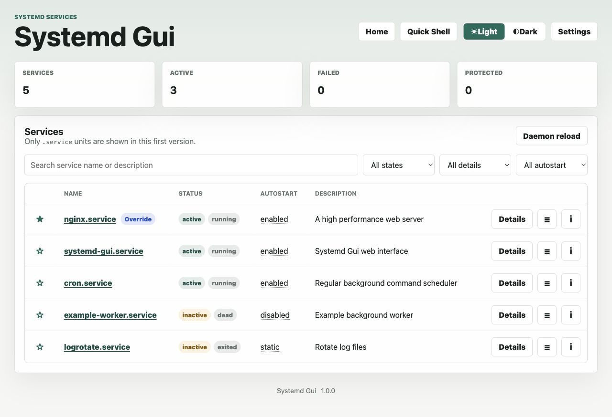
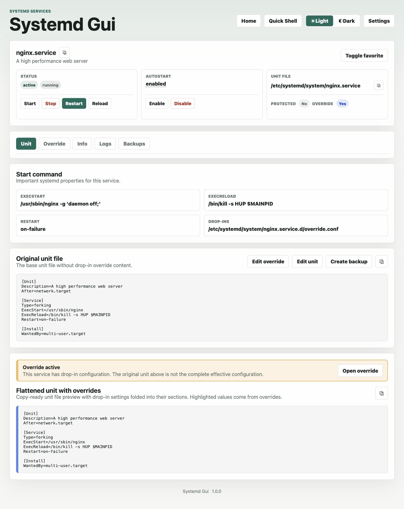
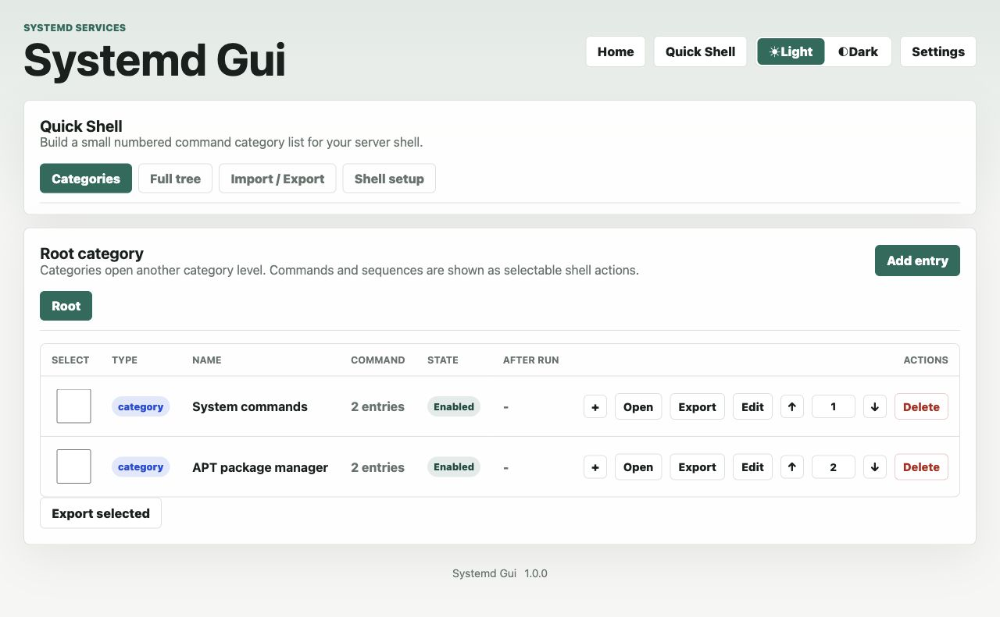
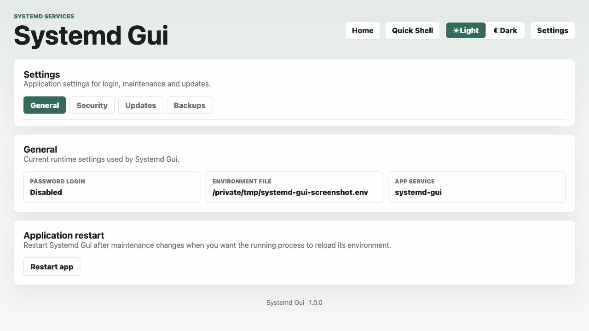
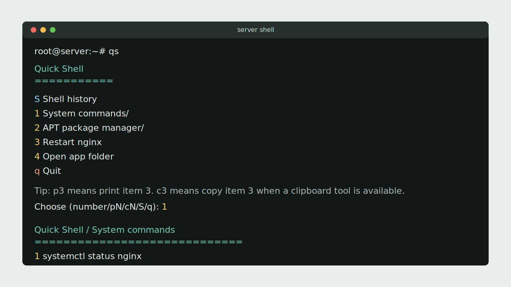

# Systemd Gui

Systemd Gui is a small web interface for managing systemd `.service` units and
local Quick Shell command shortcuts on Debian-style servers. It is intended for
users who prefer a browser UI over working with SSH, `nano`, `vi`, `systemctl`
and `journalctl`.

The app is written in Python with Flask and is installed behind nginx and
Gunicorn.

## Screenshots

| Services overview | Service detail |
| --- | --- |
|  |  |

| Quick Shell | Settings |
| --- | --- |
|  |  |

| Quick Shell terminal |
| --- |
|  |

## Features

### Systemd Services

- List `.service` units with status, detailed state and autostart state.
- Filter and search services.
- Mark favorite services.
- Start, stop, restart and reload services.
- Enable and disable autostart when systemd supports it.
- Run `systemctl daemon-reload` after unit or override changes.
- Block protected services such as `ssh`, `networking` and `systemd-*` by default.

### Unit Files And Overrides

- View original unit files and detected drop-ins.
- Create and edit safe drop-in overrides without changing package-owned unit files.
- Preview merged unit content so override changes are easier to understand.
- Edit editable unit files below `/etc/systemd/system`.
- Create, restore, delete and download unit backups.

### Logs And Service Notes

- View service logs from `journalctl`.
- Open logs in a separate live-view window.
- Search loaded log lines.
- Choose how many log lines are loaded.
- Store per-service notes.
- Show curated beginner-friendly service information.

### Quick Shell

- Manage a local command menu for the `qs` helper.
- Create commands, categories and command sequences from the web UI.
- Use nested categories and direct paths such as `qs 1-2-3`.
- Import, export and back up Quick Shell command sets.
- Use placeholders such as `apt search {package}` and answer them in the shell.
- Add optional shell integration for commands such as `cd /opt`.

### Settings, Security And Updates

- Change the web login password.
- Check official GitHub releases.
- Update from release ZIP, uploaded ZIP or git branch.
- Create, restore and delete app update backups.

## Quick Shell

Quick Shell adds a local shell command:

```bash
qs
```

The web UI manages the menu, but commands are executed from the local server
shell where `qs` is started. Commands are not run directly from the browser.

Quick Shell entries are stored in:

```text
data/quick-shell.json
```

Importable example command packs are stored in:

```text
docs/quick-shell-templates
```

Entries can be nested into categories and subcategories. Disabled entries stay
stored in the web UI but are hidden from the `qs` menu. By default, `qs` exits
after a command runs. Enable **Show menu after command** on individual commands
when you want the menu to open again afterward.

Commands can use placeholders:

```bash
apt search {package}
```

When the command is selected in `qs`, the shell asks for the missing value.

Simple directory commands such as `cd`, `cd /opt` and `cd ~/project` need Shell
Integration when they should change the current shell. The Quick Shell page can
install or remove integration for detected shell families such as bash/sh and
zsh. Normal commands do not need integration and work through the global helper.

Fresh installations create `/usr/local/bin/qs` automatically. If you added Quick
Shell through a Git update, open **Quick Shell** in the web UI and use **Install
or update helper** once.

## Safety

Systemd Gui can control system services and should be treated as an
administrative tool. Keep it on a private network or behind your own access
controls.

The app intentionally limits the first release to `.service` units. Protected
services such as `ssh`, `networking` and `systemd-*` are blocked by default to
reduce the risk of locking yourself out of a server.

Direct unit editing is limited to real unit files below `/etc/systemd/system`.
Vendor units should be changed through proper overrides or drop-ins instead of
editing package-owned files directly.

## Ports

The Debian installer uses:

- Public nginx port: `8850`
- Internal Gunicorn bind: `127.0.0.1:8851`

These can be overridden through environment variables before running the
installer.

## Install On Debian 12

Run as root:

```bash
cd /opt
git clone https://github.com/Nisbo/systemd-gui.git systemd-gui
cd /opt/systemd-gui
./scripts/install_debian.sh
```

At the end, the installer prints the generated login password.

Open:

```text
http://YOUR-SERVER-IP:8850
```

## Installer Environment Variables

You can override defaults before running the installer:

```bash
export SYSTEMD_GUI_PUBLIC_PORT=8850
export SYSTEMD_GUI_HOST=127.0.0.1
export SYSTEMD_GUI_PORT=8851
export SYSTEMD_GUI_PASSWORD='change-me'
./scripts/install_debian.sh
```

The installer writes `/etc/systemd-gui.env`, creates the
`systemd-gui.service` systemd unit, configures nginx and starts the app.

## Updates And Backups

The Settings page includes update actions and app update backups.

Before replacing app files, Systemd Gui creates an app backup under:

```text
data/app-updates/backups
```

App backups include the application files plus selected runtime data such as
favorites, service notes, Quick Shell entries, unit backups and environment-file
backups. The app backup directory itself is not copied recursively.

## License

MIT License. See [LICENSE](LICENSE).
