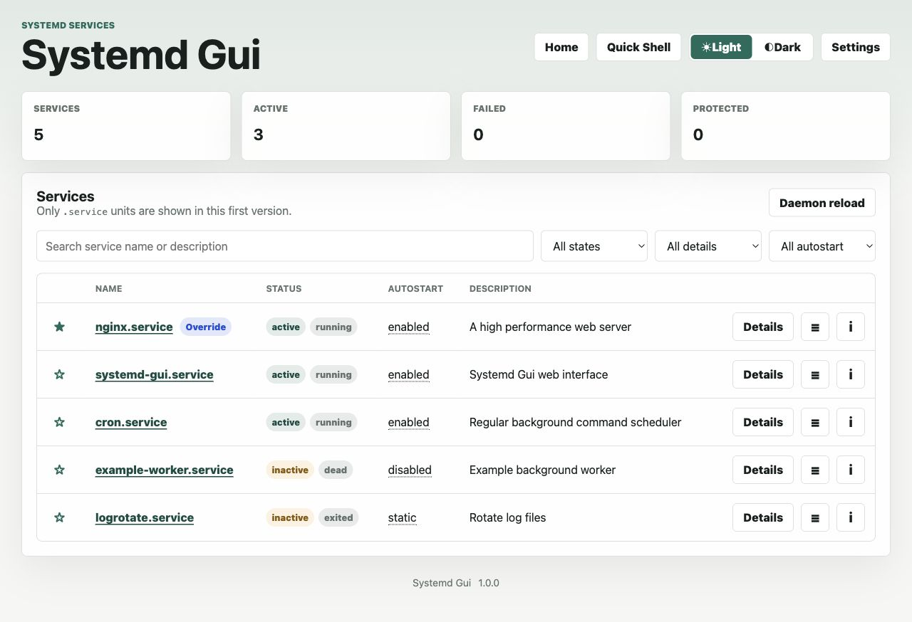
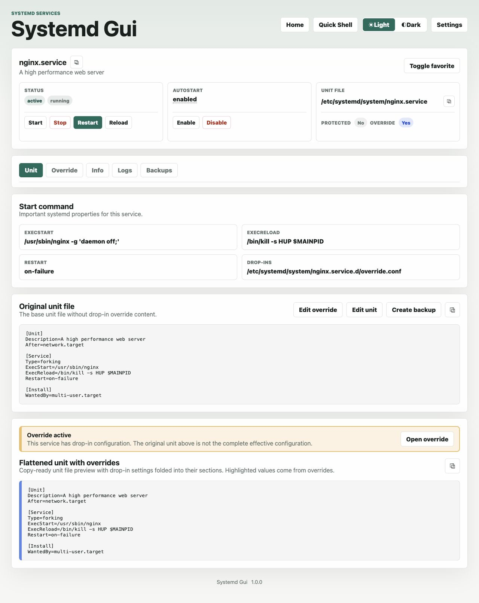
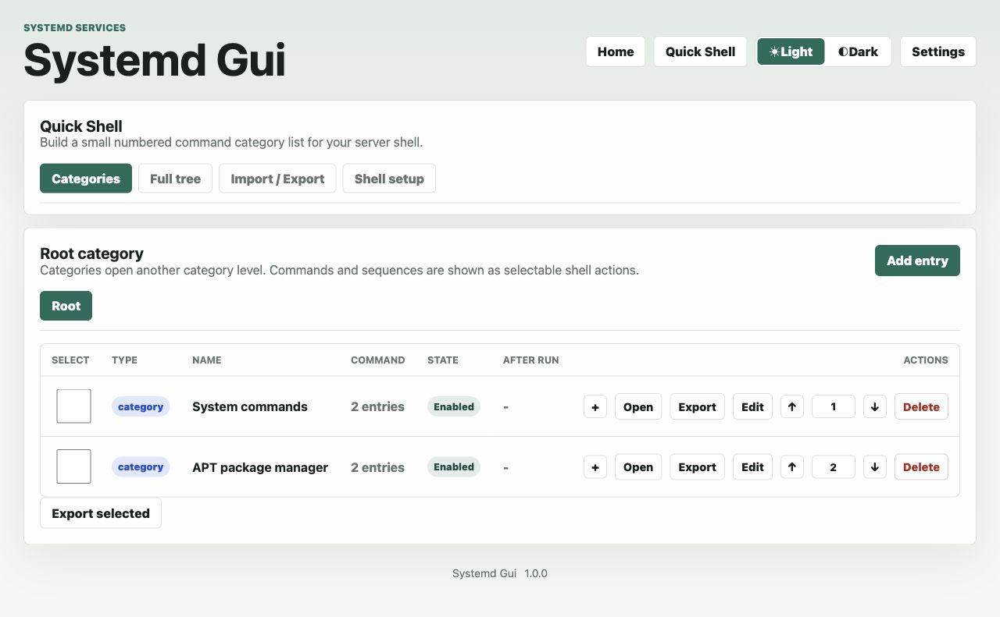
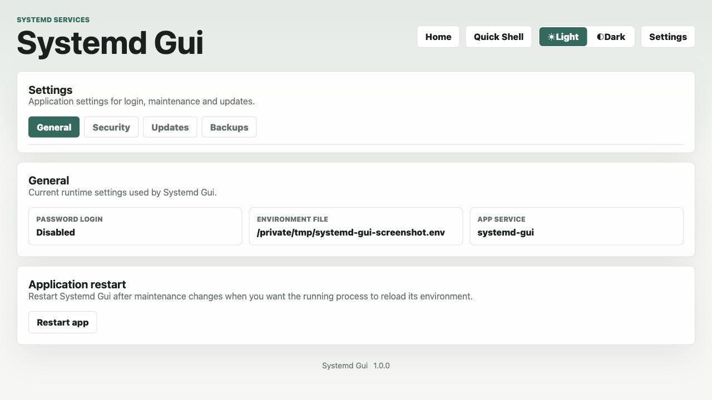
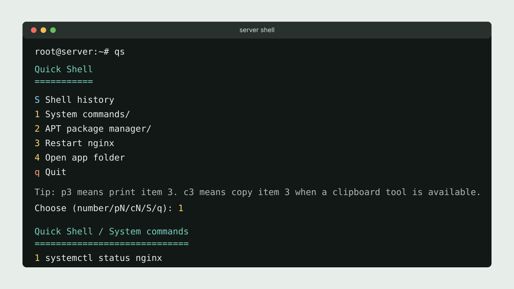

# Systemd Gui

Systemd Gui is a small web interface for managing systemd `.service` units and
local Quick Shell command shortcuts on Debian-style servers. It is intended for
users who prefer a browser UI over working with SSH, `nano`, `vi`, `systemctl`
and `journalctl`.

The app is written in Python with Flask and is installed behind nginx and
Gunicorn.

## Screenshots

| Services overview | Service detail |
| --- | --- |
|  |  |

| Quick Shell | Settings |
| --- | --- |
|  |  |

| Quick Shell terminal |
| --- |
|  |

## Features

### Systemd Services

- List `.service` units with status, detailed state and autostart state.
- Filter and search services.
- Mark favorite services.
- Start, stop, restart and reload services.
- Enable and disable autostart when systemd supports it.
- Run `systemctl daemon-reload` after unit or override changes.
- Block protected services such as `ssh`, `networking` and `systemd-*` by default.

### Unit Files And Overrides

- View original unit files and detected drop-ins.
- Create and edit safe drop-in overrides without changing package-owned unit files.
- Preview merged unit content so override changes are easier to understand.
- Edit editable unit files below `/etc/systemd/system`.
- Create, restore, delete and download unit backups.

### Logs And Service Notes

- View service logs from `journalctl`.
- View all journal logs from one page.
- Filter logs by minimum priority such as debug, info, warning or error.
- Show explicit priority labels in each loaded log line, with color hints for warning and error levels.
- Open logs in a separate live-view window.
- Search loaded log lines.
- Choose how many log lines are loaded.
- Toggle line wrapping for long log output.
- Store per-service notes.
- Show curated beginner-friendly service information.

### Quick Shell

- Manage a local command menu for the `qs` helper.
- Create commands, categories and command sequences from the web UI.
- Use nested categories and direct paths such as `qs 1-2-3`.
- Import, export and back up Quick Shell command sets.
- Use placeholders such as `apt search {package}` and answer them in the shell.
- Use readable step labels in sequences with `@ Friendly step name` on the line
  before a command.
- Open command history from `qs` and choose between shell history, Quick Shell
  run history or both combined.
- Add optional shell integration for commands such as `cd /opt`.

### Nodes

- Discover other Systemd Gui installations on the local network with Avahi/mDNS.
- Save discovered nodes so they remain visible even when offline.
- Store optional SSH connection details for future Quick Shell remote access.
- Create Remote API tokens with access categories for later cross-node features.
- Restrict Remote API tokens by fixed IP addresses, CIDR ranges or saved node IPs.
- Open saved or discovered node GUIs directly from the browser.
- Announce the local node on the LAN with an on/off setting.

### Settings, Security And Updates

- Change the web login password.
- Check official GitHub releases.
- Update from release ZIP, uploaded ZIP or git branch.
- Create, restore and delete app update backups.

## Quick Shell

Quick Shell adds a local shell command:

```bash
qs
```

The web UI manages the menu, but commands are executed from the local server
shell where `qs` is started. Commands are not run directly from the browser.

Quick Shell entries are stored in:

```text
data/quick-shell.json
```

Quick Shell run history is stored separately in:

```text
data/quick-shell-runs.json
```

Importable example command packs are stored in:

```text
docs/quick-shell-templates
```

Entries can be nested into categories and subcategories. Disabled entries stay
stored in the web UI but are hidden from the `qs` menu. By default, `qs` exits
after a command runs. Enable **Show menu after command** on individual commands
when you want the menu to open again afterward.

Commands can use placeholders:

```bash
apt search {package}
```

When the command is selected in `qs`, the shell asks for the missing value.

Press `S` inside `qs` to open command history. The history source can be changed
in **Quick Shell > Shell setup**: shell history only, Quick Shell run history
only, or both combined.

Press `N` inside the root `qs` menu to open **Remote nodes**. Saved nodes from
`data/nodes.json` are shown there when they have an SSH host. Selecting a node
opens SSH and starts `qs` on the remote server. SSH keys work with the normal
SSH client. Saved SSH passwords require `sshpass`, which fresh Debian installs
include and older installs can add from **Quick Shell > Shell setup**.
Each saved node controls whether remote `qs` stays open after commands, closes
after a command, or asks when connecting. Remote `qs` always uses the target
server's own Quick Shell menu and data files.

Sequences run multiple commands in a separate shell. Put one command on each
line. Lines starting with `#` are comments that can be printed before the next
command. Lines starting with `@` are display labels for the next command, so a
sequence can show a readable step name while the real command remains hidden in
the script.

Simple directory commands such as `cd`, `cd /opt` and `cd ~/project` need Shell
Integration when they should change the current shell. The Quick Shell page can
install or remove integration for detected shell families such as bash/sh and
zsh. Normal commands do not need integration and work through the global helper.

Fresh installations create `/usr/local/bin/qs` automatically. If you added Quick
Shell through a Git update, open **Quick Shell** in the web UI and use **Install
or update helper** once.

## Nodes And LAN Discovery

The Nodes page can discover other Systemd Gui installations on the same LAN
through Avahi/mDNS service type:

```text
_systemd-gui._tcp.local
```

Fresh Debian installs include `avahi-daemon`, `avahi-utils` and `sshpass`,
announce the local node by default and create:

```text
data/nodes.json
```

You can disable local announcement on the Nodes page. Saved nodes can include
optional SSH user, host, port and key-path fields. SSH passwords can also be
stored, but SSH keys are recommended because local password storage only protects
against casual exposure, not a compromised server.

The Nodes page also contains the Remote API access foundation. This is used for
future cross-node features such as reading logs from another Systemd Gui node or
copying Quick Shell command sets between nodes. Access is disabled by default.
When enabled, every request needs a token. Tokens are only shown once when they
are created; the local node stores only a hash.

Remote API tokens can be limited by access category:

- Node info
- Service list and details
- Journal logs
- Quick Shell exports

You can also restrict which client IPs may use a valid token. Exact IP addresses
and CIDR ranges are supported, for example:

```text
192.168.178.89
192.168.178.0/24
```

Fixed IP addresses or static DHCP leases are easiest to maintain. If your router
assigns dynamic IPs, a node's address can change later and an IP allowlist entry
may stop matching. The optional **Allow IPs from saved nodes** setting can use
saved node addresses as an allowlist, but a valid token is still required.

Saved nodes can store a Remote API token from the target node. Use **Check API**
on the Nodes page to verify that the saved token, the selected access category
and the IP rules work.

If the app was updated from an older version and Avahi is missing, the Nodes
page offers **Install/repair LAN discovery**. On Debian-style systems this
installs `avahi-daemon` and `avahi-utils`, starts Avahi and writes the local
Systemd Gui announcement.

## Safety

Systemd Gui can control system services and should be treated as an
administrative tool. Keep it on a private network or behind your own access
controls.

The app intentionally limits the first release to `.service` units. Protected
services such as `ssh`, `networking` and `systemd-*` are blocked by default to
reduce the risk of locking yourself out of a server.

Direct unit editing is limited to real unit files below `/etc/systemd/system`.
Vendor units should be changed through proper overrides or drop-ins instead of
editing package-owned files directly.

## Ports

The Debian installer uses:

- Public nginx port: `8850`
- Internal Gunicorn bind: `127.0.0.1:8851`

These can be overridden through environment variables before running the
installer.

## Install On Debian 12

Run as root:

```bash
cd /opt
git clone https://github.com/Nisbo/systemd-gui.git systemd-gui
cd /opt/systemd-gui
./scripts/install_debian.sh
```

At the end, the installer prints the generated login password and the detected
IPv4 URL, for example `http://192.168.1.20:8850`.

Open:

```text
http://SERVER-IP:8850
```

## Installer Environment Variables

You can override defaults before running the installer:

```bash
export SYSTEMD_GUI_PUBLIC_PORT=8850
export SYSTEMD_GUI_HOST=127.0.0.1
export SYSTEMD_GUI_PORT=8851
export SYSTEMD_GUI_PASSWORD='change-me'
./scripts/install_debian.sh
```

The installer writes `/etc/systemd-gui.env`, creates the
`systemd-gui.service` systemd unit, configures nginx and starts the app.

### Existing Reverse Proxy

If port 80 is already used by another reverse proxy such as Nginx Proxy Manager,
Docker, Caddy or Traefik, the installer asks whether it should use reverse proxy
mode. In that mode it skips installer-managed nginx and binds Gunicorn to
`0.0.0.0:8851`.

You can also force this mode:

```bash
export SYSTEMD_GUI_SKIP_NGINX=1
./scripts/install_debian.sh
```

Then point the existing reverse proxy to:

```text
http://SERVER-IP:8851
```

The installer also prints this direct IPv4 target when reverse proxy mode is
used.

## Updates And Backups

The Settings page includes update actions and app update backups.

Before replacing app files, Systemd Gui creates an app backup under:

```text
data/app-updates/backups
```

App backups include the application files plus selected runtime data such as
favorites, service notes, Quick Shell entries, saved nodes, Remote API access
tokens, unit backups and environment-file backups. The app backup directory
itself is not copied recursively.

## License

MIT License. See [LICENSE](LICENSE).
